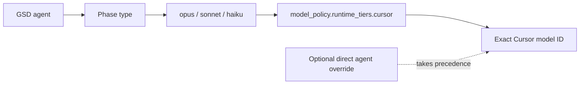

<div align="center">

# gsd-cursor

### Researched Cursor model routing for GSD Core

Six phase-aware profiles. Exact Cursor model IDs. Safe install, local validation, and exact restore — without patching GSD Core.

[](https://github.com/clezcoding/gsd-cursor/releases/latest)
[](https://github.com/clezcoding/gsd-cursor/actions/workflows/ci.yml)
[](https://nodejs.org/)
[](https://github.com/open-gsd/gsd-core)
[](LICENSE)

**`max` · `hybrid` · `value` · `budget` · `frontier` · `openweight`**

Anthropic · Cursor · OpenAI · Kimi · Google · Z.ai

[Quick start](#quick-start) · [Choose a profile](#choose-a-profile) · [CLI](#cli-reference) · [Safety](#safe-configuration-management) · [Troubleshooting](#troubleshooting)

</div>

---

## What is gsd-cursor?

`gsd-cursor` is a dependency-free CLI that installs a complete Cursor model-routing policy into an existing [GSD Core](https://github.com/open-gsd/gsd-core) configuration.

GSD assigns work to abstract tiers such as `opus`, `sonnet`, and `haiku`. Cursor exposes a broad, frequently changing catalog with provider-specific IDs. `gsd-cursor` connects those two systems:

```text
GSD agent → phase → tier → exact Cursor model ID
```

Instead of maintaining that mapping manually, choose one of six opinionated profiles. Each profile defines:

- a complete tier map for the Cursor runtime;
- routing for all six current GSD phases;
- targeted agent overrides where a specialist model materially improves the result;
- model provenance and operational notes;
- a reversible configuration update with a pre-install snapshot.

The project is an **EoS (Embeddable Orchestration System)** integration. It configures GSD through documented extension points and never modifies, forks, or monkey-patches `open-gsd/gsd-core`.

## Why use it?

Cursor's model picker is broad enough that a single “best model” is usually the wrong answer. Planning, implementation, repository mapping, research, and verification have different cost, latency, context, and reasoning requirements.

`gsd-cursor` makes those trade-offs explicit:

| Need | Profile |
|---|---|
| Highest possible quality | [`max`](#max--no-compromise-quality) |
| Strong, diverse daily default | [`hybrid`](#hybrid--balanced-multi-vendor-default) |
| Best measured performance per dollar | [`value`](#value--performance-per-dollar) |
| Low-cost daily automation | [`budget`](#budget--low-cost-daily-work) |
| Cursor-developed models only | [`frontier`](#frontier--cursor-native-frontier) |
| Kimi and GLM open-weight families | [`openweight`](#openweight--kimi--glm) |

### At a glance

| Capability | Behavior |
|---|---|
| Runtime | Sets GSD runtime to `cursor` |
| Current GSD policy | Writes `model_policy.runtime_tiers.cursor` |
| Compatibility | Also writes `model_profile_overrides.cursor` for earlier GSD releases |
| Phase coverage | Routes `planning`, `discuss`, `research`, `execution`, `verification`, and `completion` |
| Specialist routing | Adds a small set of profile-specific `model_overrides` |
| Validation | Checks exact IDs against the signed-in local Cursor CLI catalog |
| Write safety | Rejects malformed JSON, backs up the previous file, and replaces atomically |
| Uninstall | Restores the exact pre-install values for every managed field |
| Dependencies | Node.js built-ins only; zero runtime npm dependencies |
| Network use | The gsd-cursor CLI itself makes no network requests |

## Quick start

### Prerequisites

- Node.js 18 or newer;
- GSD Core 1.0.0 or newer;
- Cursor Desktop and the signed-in Cursor CLI;
- access to the models used by the selected profile.

Check the local tools:

```bash
node --version
agent --version
```

### Install

Install the pinned release from GitHub:

```bash
npm install --global github:clezcoding/gsd-cursor#v1.1.0
```

From a GSD project, install the default `hybrid` profile:

```bash
gsd-cursor install --local
```

Validate every model ID against your signed-in Cursor account:

```bash
gsd-cursor doctor
```

Inspect the active configuration:

```bash
gsd-cursor status
```

> [!TIP]
> Use `--local` for reproducible project-specific routing. Without an explicit scope, gsd-cursor selects local scope only when the current directory already contains `.planning/`; otherwise it uses the global defaults.

## Choose a profile

### Profile comparison

| Profile | Primary goal | Opus tier | Sonnet tier | Haiku tier |
|---|---|---|---|---|
| **`max`** | No-compromise quality | `claude-fable-5-thinking-max` | `claude-opus-5-thinking-max` | `gpt-5.6-sol-max` |
| **`hybrid`** *(default)* | Balanced multi-vendor work | `claude-opus-5-thinking-high` | `kimi-k3-high` | `composer-2.5` |
| **`value`** | Performance per dollar | `cursor-grok-4.5-high` | `gpt-5.6-terra-xhigh` | `composer-2.5` |
| **`budget`** | Low-cost daily work | `glm-5.2-high` | `composer-2.5` | `gpt-5.6-luna-medium` |
| **`frontier`** | Cursor-native models only | `cursor-grok-4.5-high-fast` | `composer-2.5` | `cursor-grok-4.5-low-fast` |
| **`openweight`** | Kimi + GLM | `kimi-k3-max` | `glm-5.2-max` | `kimi-k2.7-code` |

### Phase routing

The values below are tiers. Each tier resolves through the model map shown above.

| Profile | Planning | Discuss | Research | Execution | Verification | Completion |
|---|---|---|---|---|---|---|
| `max` | opus | opus | sonnet | opus | haiku | haiku |
| `hybrid` | opus | opus | haiku | sonnet | haiku | sonnet |
| `value` | opus | opus | haiku | sonnet | opus | sonnet |
| `budget` | opus | opus | haiku | sonnet | sonnet | sonnet |
| `frontier` | opus | opus | sonnet | sonnet | opus | sonnet |
| `openweight` | opus | opus | opus | haiku | sonnet | sonnet |

### Specialist overrides

Direct agent overrides take precedence over phase tiers for the named GSD agent.

| Profile | GSD agent | Exact model ID | Purpose |
|---|---|---|---|
| `hybrid` | `gsd-code-reviewer` | `gpt-5.6-sol-high` | Independent high-rigor review |
| `hybrid` | `gsd-security-auditor` | `gpt-5.6-sol-high` | Security verification |
| `hybrid` | `gsd-verifier` | `gpt-5.6-sol-high` | Goal-backward verification |
| `budget` | `gsd-ai-researcher` | `gemini-3.6-flash-medium` | Large-context AI research |
| `budget` | `gsd-ui-researcher` | `gemini-3.6-flash-medium` | UI and multimodal research |
| `frontier` | `gsd-executor` | `cursor-grok-4.5-medium` | Sustained implementation without Fast pricing |
| `frontier` | `gsd-codebase-mapper` | `composer-2.5-fast` | Low-latency repository mapping |
| `frontier` | `gsd-pattern-mapper` | `composer-2.5-fast` | Low-latency pattern discovery |
| `frontier` | `gsd-doc-classifier` | `composer-2.5` | Efficient document classification |
| `frontier` | `gsd-research-synthesizer` | `composer-2.5` | Efficient synthesis |
| `openweight` | `gsd-doc-classifier` | `glm-5.2-high` | Economical classification |
| `openweight` | `gsd-integration-checker` | `glm-5.2-high` | Independent integration checks |
| `openweight` | `gsd-plan-checker` | `glm-5.2-high` | Independent plan checks |

### `max` — no-compromise quality

Use `max` when correctness and depth matter more than cost: architecture changes, difficult migrations, security-sensitive implementation, or long-running autonomous work.

- Fable 5 Max handles planning, discussion, and execution.
- Opus 5 Max handles research through a separate frontier family.
- GPT-5.6 Sol Max performs verification and completion.

> [!WARNING]
> Cursor does not show Fable 5 as ZDR-eligible. Review your organization's retention requirements before sending sensitive code. `max` is also expected to be the most expensive profile.

```bash
gsd-cursor install --profile max --local
```

### `hybrid` — balanced multi-vendor default

`hybrid` is the recommended starting point. It deliberately separates planning, execution, volume work, and critical verification across four model families.

- Opus 5 High plans and discusses.
- Kimi K3 High performs most implementation and completion work.
- Composer 2.5 handles research and lightweight verification.
- GPT-5.6 Sol High independently reviews security, code quality, and final goal achievement.

```bash
gsd-cursor install --profile hybrid --local
```

### `value` — performance per dollar

`value` concentrates premium reasoning where it has the greatest leverage.

- Cursor Grok 4.5 High handles plans, decisions, and verification.
- GPT-5.6 Terra XHigh handles execution and completion.
- Composer 2.5 handles research volume.

CursorBench currently places Grok 4.5 High among the strongest cost-adjusted models. Cursor also discloses that an older Cursor repository snapshot entered Grok training, which may give it an unknown advantage on that benchmark. Treat benchmark scores as evidence, not certainty.

```bash
gsd-cursor install --profile value --local
```

### `budget` — low-cost daily work

`budget` avoids legacy low-end models and instead combines current economical families.

- GLM 5.2 High handles planning and discussion.
- Composer 2.5 performs execution, verification, and completion.
- GPT-5.6 Luna Medium handles routine research.
- Gemini 3.6 Flash Medium is reserved for AI and UI research where its context and multimodal capabilities are useful.

```bash
gsd-cursor install --profile budget --local
```

### `frontier` — Cursor-native frontier

`frontier` uses only models developed or jointly developed by Cursor: Cursor Grok 4.5 and Composer 2.5.

The Sonnet tier intentionally maps to **`composer-2.5`**. Fast Composer is limited to mapping agents, while Grok Medium is assigned directly to execution. This keeps everyday agent work responsive without applying Fast pricing to every Sonnet-tier request.

- Opus: `cursor-grok-4.5-high-fast`
- Sonnet: `composer-2.5`
- Haiku: `cursor-grok-4.5-low-fast`
- Execution: `cursor-grok-4.5-medium`
- Mapping: `composer-2.5-fast`

```bash
gsd-cursor install --profile frontier --local
```

> [!NOTE]
> Cursor states that Composer 2.5 Fast has the same intelligence as Composer 2.5, with lower latency and higher token prices. Fast variants are therefore used selectively.

### `openweight` — Kimi + GLM

`openweight` is a two-family stack for users who explicitly want Kimi and GLM throughout the workflow.

- Kimi K3 Max handles long-horizon planning, discussion, and research.
- Kimi K2.7 Code handles focused implementation.
- GLM 5.2 Max provides an independent verification and completion path.
- GLM 5.2 High handles lighter classification and checking tasks.

```bash
gsd-cursor install --profile openweight --local
```

> [!IMPORTANT]
> “Open-weight” describes the model families, not where inference runs. These IDs still use Cursor's hosted model routing; gsd-cursor does not download or run model weights locally.

## How routing works



For `hybrid`, the installed configuration includes the following effective structure:

```json
{
  "runtime": "cursor",
  "model_profile": "balanced",
  "model_policy": {
    "runtime_tiers": {
      "cursor": {
        "opus": { "model": "claude-opus-5-thinking-high" },
        "sonnet": { "model": "kimi-k3-high" },
        "haiku": { "model": "composer-2.5" }
      }
    }
  },
  "model_profile_overrides": {
    "cursor": {
      "opus": "claude-opus-5-thinking-high",
      "sonnet": "kimi-k3-high",
      "haiku": "composer-2.5"
    }
  },
  "models": {
    "planning": "opus",
    "discuss": "opus",
    "research": "haiku",
    "execution": "sonnet",
    "verification": "haiku",
    "completion": "sonnet"
  },
  "model_overrides": {
    "gsd-code-reviewer": "gpt-5.6-sol-high",
    "gsd-security-auditor": "gpt-5.6-sol-high",
    "gsd-verifier": "gpt-5.6-sol-high"
  }
}
```

The two Cursor tier-map blocks intentionally contain the same data:

- `model_policy.runtime_tiers.cursor` is the current GSD runtime-policy surface.
- `model_profile_overrides.cursor` keeps compatibility with GSD releases using the earlier override surface.

## CLI reference

### Command summary

| Command | Purpose |
|---|---|
| `gsd-cursor install` | Install the default `hybrid` profile |
| `gsd-cursor install --profile <name>` | Install a specific profile |
| `gsd-cursor use <name>` | Switch the selected configuration to another profile |
| `gsd-cursor list` | Display all bundled profiles and exact tier IDs |
| `gsd-cursor status` | Display active profile, routing, overrides, and restore state |
| `gsd-cursor doctor` | Validate every selected model ID through the local Cursor CLI |
| `gsd-cursor uninstall` | Restore pre-install values for every managed field |

All commands that read or change configuration accept `--local` or `--global`. `doctor` also accepts `--profile` to validate a profile before installing it.

### Install

```text
gsd-cursor install [--profile <max|hybrid|value|budget|frontier|openweight>] [--local|--global]
```

Examples:

```bash
gsd-cursor install
gsd-cursor install --profile frontier --local
gsd-cursor install --profile openweight --global
```

### Switch profile

```text
gsd-cursor use <max|hybrid|value|budget|frontier|openweight> [--local|--global]
```

```bash
gsd-cursor use value --local
```

The original pre-install snapshot is retained across profile switches. Uninstall therefore restores the state from before the first managed install, not the previously selected gsd-cursor profile.

### Validate models

```text
gsd-cursor doctor [--profile <name>] [--local|--global]
```

`doctor` runs the following signed-in local Cursor command without a shell:

```bash
agent --list-models
```

It compares exact IDs, reports every missing model, and exits non-zero if the profile is not fully available.

Validate before installing:

```bash
gsd-cursor doctor --profile openweight
```

Validate the active profile:

```bash
gsd-cursor doctor --local
```

### Inspect status

```bash
gsd-cursor status --local
```

Status reports:

- active profile and package version;
- current runtime tier map;
- complete phase routing;
- direct agent overrides;
- whether an exact restore snapshot is available.

### Uninstall

```bash
gsd-cursor uninstall --local
npm uninstall --global gsd-cursor
```

For installations created by gsd-cursor 1.1.0 or newer, uninstall restores every managed value to its exact pre-install state. Unrelated settings and edits are preserved.

## Local and global scope

### Local

```bash
gsd-cursor install --profile hybrid --local
```

Writes:

```text
<current directory>/.planning/config.json
```

Use local scope when routing should be project-specific or committed with project planning state.

### Global

```bash
gsd-cursor install --profile hybrid --global
```

Writes:

```text
~/.gsd/defaults.json
```

Use global scope for a personal default inherited by projects without a local override.

### Automatic selection

When neither flag is provided:

1. If `<cwd>/.planning/` exists, use local scope.
2. Otherwise, use global scope.

Explicit scope is recommended in scripts and automation.

## Safe configuration management

Configuration files are state, not disposable generated output. gsd-cursor uses four safeguards.

### 1. Strict JSON parsing

Malformed JSON is rejected. The original file is left byte-for-byte unchanged and no backup is overwritten.

### 2. Previous-file backup

Before replacing an existing configuration, the CLI writes:

```text
config.json.gsd-cursor.bak
```

This backup represents the file immediately before the most recent gsd-cursor write.

### 3. Atomic replacement

The new JSON is written to a temporary file in the same directory and renamed into place. A partially written configuration is never intentionally exposed.

### 4. Exact managed-field snapshot

On first install, `_gsd_cursor.snapshot` records whether each managed field existed and its exact prior value. Switching profiles keeps that snapshot. Uninstall uses it to restore:

- `runtime`;
- `model_profile`;
- `model_policy.runtime_tiers.cursor`;
- `model_profile_overrides.cursor`;
- all six managed phase keys inside `models`;
- every agent key that any bundled profile can manage.

Other runtime policies, provider maps, custom phases, custom agents, and unrelated configuration remain untouched.

> [!NOTE]
> A configuration installed by gsd-cursor 1.0.x has no embedded snapshot. When upgraded in place, 1.1.0 snapshots the state it sees at upgrade time. A legacy uninstall can remove managed nested values but cannot reconstruct values that 1.0.x already replaced.

## Model availability and research basis

The 1.1.0 catalog was validated against the exact output of a signed-in Cursor CLI on **2026-07-29**. The supplied Cursor UI catalog included the relevant Grok, Composer, Claude, GPT-5.6, Gemini, Kimi, and GLM families.

Availability can still vary because of:

- Cursor plan and organization policy;
- regional rollout;
- model enablement in Cursor Settings;
- Desktop/CLI versus Cloud Agents catalog differences;
- later model renames or retirement.

The local Cursor CLI is therefore authoritative for the current account. Run `gsd-cursor doctor` instead of assuming that an ID visible in documentation is enabled for you.

### Research references

- [CursorBench 3.2](https://cursor.com/evals) — relative coding-agent quality, cost per task, token use, and statistical caveats.
- [Cursor Grok 4.5](https://cursor.com/grok) — Cursor's long-horizon coding and knowledge-work model.
- [Composer 2.5](https://cursor.com/blog/composer-2-5) — standard and Fast behavior and pricing trade-offs.
- [Kimi K3](https://github.com/MoonshotAI/Kimi-K3) — long-horizon coding, repository work, terminal tools, and large context.
- [GLM 5.2](https://huggingface.co/zai-org/GLM-5.2) — open-weight long-horizon flagship model card.
- [Gemini 3.6 Flash](https://ai.google.dev/gemini-api/docs/models/gemini-3.6-flash) — large-context, multimodal, agentic coding model.

Benchmark results are snapshots, not guarantees. Small differences can be statistically insignificant, real project distributions differ from benchmark tasks, and latency varies by region and service load. Profile design therefore combines benchmark evidence with specialization, provider independence, context needs, and operational cost.

## Upgrade from 1.0.x

Install the new release:

```bash
npm install --global github:clezcoding/gsd-cursor#v1.1.0
```

Inspect the new catalog:

```bash
gsd-cursor list
```

Validate the intended profile:

```bash
gsd-cursor doctor --profile hybrid
```

Re-apply the profile to write current policy keys, all six phases, and the restore snapshot:

```bash
gsd-cursor install --profile hybrid --local
```

Major changes from 1.0.x:

- four profiles expanded to six;
- invalid IDs such as `gemini-3-pro` and `glm-5.2` replaced with current exact Cursor IDs;
- Opus 4.8 and older GPT defaults replaced with current families;
- all six GSD phases are routed;
- current `model_policy.runtime_tiers.cursor` support added;
- targeted agent overrides added;
- strict parsing, backup, atomic writes, exact restore, and `doctor` added;
- `frontier` and `openweight` profiles added.

## Troubleshooting

### A model is reported missing

Run:

```bash
agent --list-models
gsd-cursor doctor --profile <name>
```

Confirm the model is enabled in **Cursor → Settings → Models**. If your organization restricts a provider, choose a profile that avoids it:

- Cursor-only: `frontier`
- Kimi + GLM: `openweight`
- broad provider mix: `hybrid`

### `agent` is not found

Install or update Cursor CLI and sign in. `doctor` needs the local `agent` executable, but profile installation does not.

For non-standard installations, point `doctor` at the executable:

```bash
GSD_CURSOR_AGENT_BIN=/absolute/path/to/agent gsd-cursor doctor
```

### The wrong config file changed

Automatic scope selection depends on whether `.planning/` exists in the current directory. Use an explicit flag:

```bash
gsd-cursor status --local
gsd-cursor status --global
```

Then install or switch with the intended scope.

### The config file contains invalid JSON

gsd-cursor will refuse to write and print the parse error. Repair the JSON manually, validate it, and retry. The CLI intentionally does not silently replace malformed configuration with an empty object.

### I need the state from before the last write

Use the immediate backup:

```bash
cp .planning/config.json.gsd-cursor.bak .planning/config.json
```

To restore the state from before the first 1.1.0 install while preserving unrelated later changes, use:

```bash
gsd-cursor uninstall --local
```

### Cursor Cloud Agents exposes fewer models

This catalog targets Cursor Desktop and Cursor CLI. Cloud Agents can expose a smaller list. Validate on the surface where GSD will actually run and choose a compatible profile.

### A custom agent override disappeared while switching profiles

gsd-cursor only manages agent names used by its bundled profiles. If you had a value for one of those exact agents before installation, it is retained in the snapshot and restored on uninstall. During an active profile, the selected profile owns that agent key by design.

## Project structure

```text
gsd-cursor/
├── bin/gsd-cursor.cjs       CLI, validation, safe writes, snapshots, restore
├── lib/profiles.json        Versioned six-profile model catalog
├── registry/eos-entry.json  GSD EoS registry metadata
├── test/cli.test.cjs        End-to-end CLI and configuration tests
└── .github/workflows/ci.yml Node.js 18, 20, and 22 test matrix
```

The runtime deliberately uses only Node.js built-ins: `fs`, `path`, `os`, and `child_process`. `child_process` is used only by `doctor` to invoke the local Cursor CLI directly with `agent --list-models`; no shell is involved.

## Design boundaries

gsd-cursor does:

- select the Cursor runtime;
- install versioned model and phase routing;
- validate local model availability;
- preserve and restore managed configuration values.

gsd-cursor does not:

- install or modify GSD Core;
- download or run model weights;
- dispatch GSD agents itself;
- change Cursor account settings;
- guarantee provider availability, benchmark performance, pricing, or ZDR eligibility;
- send source code, configuration, or telemetry over the network.

---

<div align="center">

Start balanced:

```bash
gsd-cursor doctor --profile hybrid && gsd-cursor install --profile hybrid --local
```

</div>
